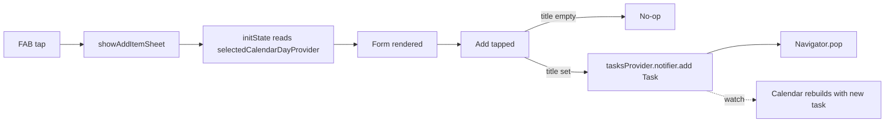

# Add Task Button — Conversation Notes

This document covers the global "+" button feature: the floating action button (FAB) and the bottom sheet it opens for creating tasks. The feature is app-wide, not specific to the calendar.

## Purpose

A single entry point for adding new tasks from anywhere in the app. The FAB lives in the shell (visible on all tabs), and opens a bottom sheet that creates a `Task` in the shared state.

Because the data model is unified (see [`calendar.md`](calendar.md)), the same form handles both single-day tasks and multi-day tasks. The only difference is whether the user sets an end date.

## Where It Lives

- **FAB** — center-docked in the `BottomAppBar` of the shell scaffold, visible on every tab (Today / Matrix / Calendar / Settings)
- **Bottom sheet** — modal sheet that slides up from the bottom, dismissible by swipe-down or tap-outside

## Files

| File | Role |
|------|------|
| `lib/shared/widgets/shell_scaffold.dart` | Hosts the FAB; calls `showAddItemSheet(context)` on tap |
| `lib/features/calendar/add_item_sheet.dart` | The bottom-sheet form (lives under `features/calendar/` because the calendar was its first integration point, but the form itself is general) |
| `lib/providers/selected_day_provider.dart` | `StateProvider<DateTime>` — shared "currently selected day" used to pre-fill the start-date field |
| `lib/main.dart` | Wraps `App` in `ProviderScope` so Riverpod state is available app-wide |

## Form Layout

The bottom sheet has the following sections, top to bottom:

1. **Drag handle** — small pill at the top
2. **Title** — auto-focused text field, sentence capitalization
3. **Category** — wrap of colored chips (6 categories: Exam, Hackathon, Gym, Study, Work, Other). Selected chip is filled with the category's color; unselected chips are a tinted variant.
4. **Priority** — wrap of 3 chips (Low / Medium / High), color-coded green/orange/red. Same selection style as categories.
5. **When** — two stacked picker rows:
   - **Start Date** row — opens a date picker. Defaults to whatever day is currently selected in the calendar.
   - **Until…** row — by default shows the placeholder text `Until… (single day)`. Tapping it opens a date picker constrained to `firstDate: startDate`. Once set, the row shows the chosen date and an `X` button on the right that clears it back to single-day.
6. **Add** button — primary indigo button at the bottom

If the title is empty when Add is tapped, the form is a no-op (it does not dismiss).

## Pre-fill Behavior

The form reads `selectedCalendarDayProvider` in `initState` to seed `_startDate`. This means:

- Tap a date on the calendar → tap FAB → Start Date is already that day
- Open the app and tap FAB without touching the calendar → Start Date is today (the provider's initial value)
- If you change the calendar's selected day while the sheet is closed, the next sheet opens with the new default

This sharing is one-way: the sheet reads the provider but does not write back to it on submit.

## Single-Day vs Multi-Day

The unified `Task` model treats single-day vs multi-day as a property of the task itself (`endDate == null` means single-day). The form mirrors this:

- Leave **Until…** untouched → `endDate: null` → single-day task → shows as a dot on the calendar
- Set **Until…** to a date → multi-day task → shows as a spanning bar on the calendar

If the user changes the start date to a value after a previously chosen end date, the end date is automatically cleared to keep the range valid.

## How to Test

1. Launch the app
2. Navigate to the Calendar tab and tap any date (optional — sets the default start date)
3. Tap the center `+` FAB
4. Type a title
5. Pick a category and priority
6. Confirm or change Start Date
7. To make it a multi-day task, tap the "Until…" row and pick an end date; tap `X` to revert to single-day
8. Tap **Add**
9. The task appears immediately on the calendar (dot for single-day, spanning bar for multi-day) and in the day panel for every day it covers
10. Tap a tile in the day panel to toggle completion

## Submit Flow

## What's Next (Not Done)

- Edit / delete from the bottom sheet (currently it only creates)
- Tap a task tile in the calendar's day panel to open the same sheet pre-filled for editing
- Persist via Drift so tasks survive restarts
- Quick-add affordances (e.g. long-press FAB for a fast single-day task)
