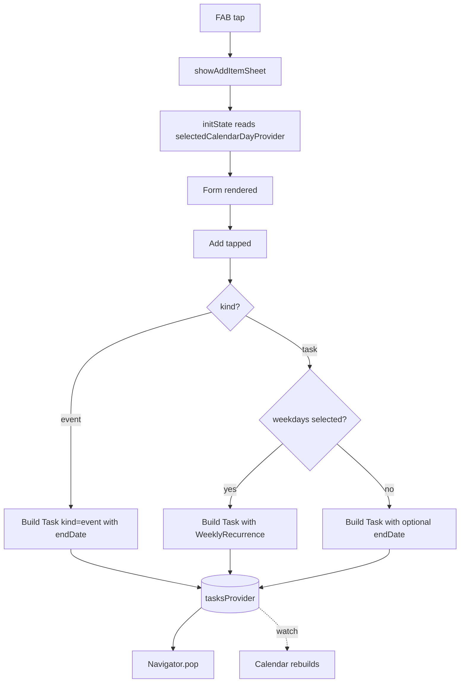

# Add Task Button — Conversation Notes

This document covers the global "+" button feature: the floating action button (FAB) and the bottom sheet it opens for creating tasks. The feature is app-wide, not specific to the calendar.

## Purpose

A single entry point for adding new tasks from anywhere in the app. The FAB lives in the shell (visible on all tabs), and opens a bottom sheet that creates a `Task` in the shared state.

Because the data model is unified (see [`calendar.md`](calendar.md)), the same form handles both single-day tasks and multi-day tasks. The only difference is whether the user sets an end date.

## Where It Lives

- **FAB** — center-docked in the `BottomAppBar` of the shell scaffold, visible on every tab (Today / Matrix / Calendar / Settings)
- **Bottom sheet** — modal sheet that slides up from the bottom, dismissible by swipe-down or tap-outside

## Files

| File | Role |
|------|------|
| `lib/shared/widgets/shell_scaffold.dart` | Hosts the FAB; calls `showAddItemSheet(context)` on tap |
| `lib/features/calendar/add_item_sheet.dart` | The bottom-sheet form (lives under `features/calendar/` because the calendar was its first integration point, but the form itself is general) |
| `lib/providers/selected_day_provider.dart` | `StateProvider<DateTime>` — shared "currently selected day" used to pre-fill the start-date field |
| `lib/main.dart` | Wraps `App` in `ProviderScope` so Riverpod state is available app-wide |

## Form Layout

The bottom sheet has the following sections, top to bottom:

1. **Drag handle** — small pill at the top
2. **Kind toggle** — `SegmentedButton<TaskKind>` with two options: `Task` and `Event`. Switching to `Event` clears any selected weekdays and the repeat-until state.
3. **Title** — auto-focused text field, sentence capitalization
4. **Color** — row of 8 colored circle swatches. Tap to select; selected swatch shows a white check with a soft glow.
5. **Priority** (task only) — three chips (Low / Medium / High), color-coded green/orange/red. Events have no priority and skip this section.
6. **When** — stacked picker rows:
   - **Start Date** row — opens a date picker. Defaults to whatever day is currently selected in the calendar.
   - **Until Date** row — shown only when no weekdays are selected. Optional for tasks (makes them multi-day); required for events.
7. **Repeat** (task only) — Samsung alarm style:
   - Row of 7 weekday chips (S M T W T F S, Sunday-first). Multi-select.
   - When at least one weekday is selected, the simple "Until Date" row above hides and is replaced by:
     - "Repeats until" with two chips: `Forever` (default) and `Pick a date`. Picking a date switches selection to the date chip; tapping `Forever` again clears the date.
8. **Add** button — primary indigo button at the bottom. Disabled when:
   - Title is empty, OR
   - Kind is Event and no end date is set, OR
   - Weekdays are selected and "Repeats until" is set to a date that hasn't been picked yet.

## Pre-fill Behavior

The form reads `selectedCalendarDayProvider` in `initState` to seed `_startDate`. This means:

- Tap a date on the calendar → tap FAB → Start Date is already that day
- Open the app and tap FAB without touching the calendar → Start Date is today (the provider's initial value)
- If you change the calendar's selected day while the sheet is closed, the next sheet opens with the new default

This sharing is one-way: the sheet reads the provider but does not write back to it on submit.

## Shapes a Task Can Take

The same form produces several different shapes depending on the kind + recurrence combination:

| Configuration | Result |
|---------------|--------|
| Task, no end date, no weekdays | Single-day task. Dot on the calendar. |
| Task, with end date, no weekdays | Multi-day task. Bar on the calendar. One final tick. |
| Task, weekdays selected, repeat-until Forever | Recurring task forever. Dot on each matching day. Per-day ticking. |
| Task, weekdays selected, repeat-until date | Recurring task bounded by date. Same as above but stops on the date. |
| Event, end date required | Multi-day event. Translucent bar on the calendar. No checkbox. Auto-completes once past end date. |

A task is **recurring XOR multi-day**, never both. The UI hides the "Until Date" row when weekdays are selected so the user can't try.

If the user changes the start date to a value after a previously chosen end date or repeat-until, those fields are auto-cleared to keep the range valid.

## How to Test

1. Launch the app
2. Navigate to the Calendar tab and tap any date (optional — sets the default start date)
3. Tap the center `+` FAB
4. Pick **Task** or **Event** at the top of the sheet
5. Type a title and pick a color
6. **For tasks**: pick a priority
7. Confirm or change the Start Date
8. **For events**: pick the required Until Date
9. **For tasks (optional)**: tap one or more weekday chips to make it recurring; if recurring, pick `Forever` or a "Repeats until" date
10. **For tasks (not recurring, optional)**: tap "Until…" to make it a multi-day bar instead
11. Tap **Add** (the button is disabled if required fields are missing)
12. The task appears immediately on the calendar:
    - Single-day task → dot
    - Multi-day task → solid bar
    - Event → translucent bar with event icon in the day panel (no checkbox)
    - Recurring task → dot on each matching weekday going forward
13. Tap a task tile in the day panel to toggle completion (per-day for recurring, single for non-recurring; events have no tap behavior)

## Submit Flow

## What's Next (Not Done)

- Edit / delete from the bottom sheet (currently it only creates)
- Tap a task tile in the calendar's day panel to open the same sheet pre-filled for editing
- Persist via Drift so tasks survive restarts (recurrence + `completedDates` likely become a side table)
- Quick-add affordances (e.g. long-press FAB for a fast single-day task)
