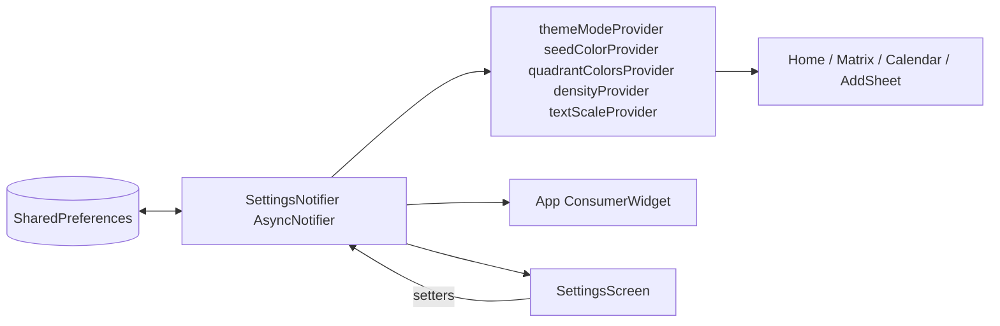

# Settings Panel — Conversation Notes

This document captures the reasoning, design, and implementation of the Settings panel. Like the other docs in this folder, it's part conversation log, part design record.

## Starting Point

Before this work, `lib/features/settings/settings_screen.dart` was a centered "Settings" placeholder string. There was:

- A single light Material 3 theme with a hardcoded indigo seed (`#5C6BC0`)
- No theme switching, no dark mode
- No persistence layer at all (`shared_preferences` not in `pubspec.yaml`)
- Many "semantic" colors hardcoded inline in screens — task accent stripes used `MatrixQuadrant.color` directly, weekday colors used literal hex, etc.

The functional matrix (Eisenhower drag-drop, task assignment) is explicitly out of scope here — Settings was meant to cover cosmetic and ergonomic preferences only.

## Reasoning Conversation

The first round of conversation was: *given that the matrix is the complex moving part, what's worth putting in the settings panel?* We walked through the layers where customization actually exists in the code today:

| Layer | What's currently hardcoded | Customization opportunity |
|------|---------------------------|--------------------------|
| Theme seed | One color in `AppTheme.light` | Curated palette presets |
| Brightness | Light only | Light / Dark / System |
| Typography | Sizes in `TextTheme` | A `textScaler` multiplier |
| Padding | `EdgeInsets` in tiles | Density multiplier |
| Quadrant colors | `MatrixQuadrant.color` enum getter | Per-quadrant override |
| Priority colors | Hex in calendar tile | (Skipped — too granular) |
| Home sections | Always-on | Per-section toggles |
| `table_calendar` start day | `StartingDayOfWeek.sunday` | Sun / Mon preference |
| Date formatting | Inline `_months[...] ${d.day}` | Format preference |

The user opted in to everything except per-priority color customization.

### Tiering it

Settings were grouped by *cost vs. visible impact*:

- **High value, low effort** — dark mode + palette presets (both flow through `ColorScheme.fromSeed` without UI churn)
- **Cheap niceties** — section toggles, first day of week, date format
- **Touches every tile** — density, quadrant colors (had to flow through providers and refactor all consumers)

The shared foundation — a `SettingsNotifier` over `SharedPreferences` plus derived providers — was the only piece that had to be built once. Every individual setting reuses it.

### Why `SharedPreferences` and not Drift

Drift is in `pubspec.yaml` but unused. Settings are simple key/value preferences, so they belong in `SharedPreferences`, not a Drift table. Keeping the two storage concerns separate also means task persistence (when it's finally wired up) doesn't entangle with appearance preferences.

## Architecture

### Why `AsyncNotifier`

Settings load asynchronously from disk on startup, but every consumer wants a synchronous read. Two patterns handle this:

1. `App` watches the raw `AsyncValue` and blocks the first frame on a tiny `CircularProgressIndicator` until prefs resolve. This prevents a flash of the default theme.
2. A `resolvedSettingsProvider` collapses the `AsyncValue` to `AppSettings` (falling back to `AppSettings.defaults` while loading). Screens watch this without `.when(...)` boilerplate.

## What Was Built

### Foundation

| File | Role |
|------|------|
| `pubspec.yaml` | Adds `shared_preferences: ^2.2.3` |
| `lib/models/app_settings.dart` | Immutable `AppSettings` data class + `TextScalePref`, `DensityPref`, `FirstDayOfWeekPref`, `DateFormatPref` enums with label / conversion extensions. `copyWith`, `toJson`, `fromJson`. |
| `lib/theme/color_palettes.dart` | `AppPalette` enum — 8 curated seed colors (Indigo, Teal, Rose, Forest, Sunset, Slate, Amber, Plum) |
| `lib/providers/settings_provider.dart` | `SettingsNotifier` (`AsyncNotifier`) persisted to `SharedPreferences` as a single JSON blob. Convenience setters for each field. Derived providers: `themeModeProvider`, `seedColorProvider`, `densityProvider`, `textScaleProvider`, `quadrantColorsProvider` (returns the full resolved map). |
| `lib/shared/date_format.dart` | `formatDate`, `formatDateLong`, `formatDateRange` helpers |

### Theme rewiring

`lib/theme/app_theme.dart`:
- Renamed `AppTheme.light` getter → `light({Color seedColor, DensityPref density})` factory
- Added symmetrical `AppTheme.dark({...})` using `ColorScheme.fromSeed(brightness: Brightness.dark, ...)` and matching dark surface/text tokens
- Both apply `VisualDensity` from the density preference
- New `AppSemanticColors` helper exposes theme-aware getters: `tileBackground`, `tileBorder`, `subtleSurface`, `subtleBorder`, `textStrong`, `textBody`, `textMuted`, `textFaint`, `navInactive`, `trackBackground`, `softShadow`. Plus three brightness-independent constants: `successGreen`, `warningOrange`, `dangerRed`.

This replaces dozens of hardcoded `Color(0xFFABCDEF)` usages across screens with single-source-of-truth getters that adapt to brightness automatically.

### App bootstrap

`lib/app.dart` is now a `ConsumerWidget` that:
- Watches the raw `settingsProvider`
- Shows a small loader while prefs load
- On success, sets `themeMode` and passes the seed color + density into both `theme` and `darkTheme`
- Wraps the router in a `MediaQuery` override applying `TextScaler.linear(scaleFactor)` so the text size preference takes effect app-wide

`lib/main.dart` now calls `WidgetsFlutterBinding.ensureInitialized()` before `runApp` so `SharedPreferences.getInstance()` can run during the notifier's first `build`.

### Screen wiring

| Screen | Changes |
|--------|---------|
| `home_screen.dart` | Conditionally renders progress card, overdue panel, and section toggle based on flags. When the toggle is hidden, only the Current list shows. Density multiplier applied in `_HomeTaskTile` padding. Date format applied to all date labels. Reads quadrant accent color from `quadrantColorsProvider`. Switched hardcoded colors to `AppSemanticColors`. |
| `calendar_screen.dart` | `TableCalendar.startingDayOfWeek` driven by `settings.firstDayOfWeek`. Day cells / bars / tiles use resolved quadrant colors. Density multiplier in `_TaskTile`. Date subtitles and day header use the format helper. Theme-aware text colors. |
| `matrix_screen.dart` | Converted to `ConsumerWidget`. Quadrant cards read color from `quadrantColorsProvider`. |
| `add_item_sheet.dart` | Quadrant picker uses resolved colors. Date pickers display `formatDateLong`. Surface and border colors come from `AppSemanticColors` so the sheet looks right in dark mode. |
| `shared/widgets/shell_scaffold.dart` | Bottom nav inactive color comes from `AppSemanticColors.navInactive` (works in dark mode). |

### Settings UI

`lib/features/settings/settings_screen.dart` is a `ConsumerWidget` with grouped sections:

| Section | Controls |
|---------|----------|
| **Appearance** | Theme mode `SegmentedButton` (Light / Dark / System); 8-swatch palette picker (horizontal scroller of color dots); text size `SegmentedButton` (S / M / L); density `SegmentedButton` (Compact / Comfortable / Spacious) |
| **Home screen** | Three custom switch tiles: progress card, overdue panel, current/upcoming toggle |
| **Calendar** | First day of week `SegmentedButton` (Sun / Mon); date format custom radio list (`May 23`, `23 May`, `23/05`) |
| **Matrix colors** | One row per `MatrixQuadrant` showing the current color swatch + label. Tap opens a `AlertDialog` with a 16-swatch curated grid (no extra dep), with a "Reset" action when the quadrant is currently overridden. |
| **Reset** | Single tile that opens a confirmation dialog and clears every preference back to defaults |

The radio list was originally implemented with `RadioListTile`, but Flutter deprecated `groupValue` / `onChanged` in favor of `RadioGroup`. Rather than depending on a specific Flutter version, a small custom `_RadioRow` widget was added — it gives the same visual without the deprecation.

## Specific Design Decisions

### Quadrant colors keep their default in the enum

`MatrixQuadrant.color` still has its const default colors. The settings layer adds *overrides* on top via `Map<MatrixQuadrant, Color>` — when a quadrant has no entry, the default wins. This means:

- The enum stays self-sufficient for code that doesn't have a `WidgetRef`
- The reset action just removes the key from the map
- Persisted data is small (only changed quadrants are stored)

### Density only touches hand-built tiles

Material widgets respond automatically to `ThemeData.visualDensity`. The tricky case is the hand-built `_HomeTaskTile` and calendar `_TaskTile`, where padding is hardcoded. Rather than refactor *every* hardcoded `EdgeInsets` in the app, density only multiplies the padding on those two tile widgets — the most visible "list of stuff" surfaces. Compact = 0.8×, Comfortable = 1.0× (default), Spacious = 1.25×.

### Text scale is in-app, not OS

The OS already has an accessibility text-scale preference. This setting is independent of it: the app applies its own multiplier via `MediaQuery.textScaler` on top of whatever the OS supplies. Users who want larger text in *just this app* don't have to change global settings.

### Theme-aware colors via a helper class

Dark mode could have been "just add a dark `ThemeData`," but most of the screens draw cards, badges, and chips with inline `Color(0xFF...)` literals. Without changing those, dark mode looks broken (white cards on dark scaffold). `AppSemanticColors` centralizes the brightness branching so every hand-built widget reads from one place. It's a thin static helper rather than another provider because brightness is already available via `Theme.of(context)`.

### Color picker dialog instead of a package

There are good color-picker packages, but for this app a 16-swatch curated grid in a plain `AlertDialog` is enough — it covers the common cases (red / pink / purple / indigo / blue / teal / green / orange / etc.) without adding a dependency or showing the user an HSL slider they don't need.

## Persistence Format

Settings serialize to a single JSON string under the key `app_settings_v1` in `SharedPreferences`. Enums are stored by `name`; colors are stored as `#AARRGGBB` strings (using `Color.toARGB32()`). If the key is missing or the JSON fails to parse, `AppSettings.defaults` is returned — graceful degradation rather than crashing the boot. The `_v1` suffix on the key gives a clean migration path if the shape changes later.

## What's Next (Not Done)

- Per-priority color customization (intentionally skipped)
- Migrating other dark-unfriendly inline colors (e.g. the overdue panel's red surface tint already uses `colorScheme.error.withValues(...)` so it adapts, but the calendar's hardcoded weekend-grey on the days-of-week strip uses `AppSemanticColors.navInactive` as an approximation — could be its own token)
- Persisting tasks themselves via Drift (still in-memory) — orthogonal to this work
- Localization-aware date formatting via `intl` package if the app ever needs more than three formats
